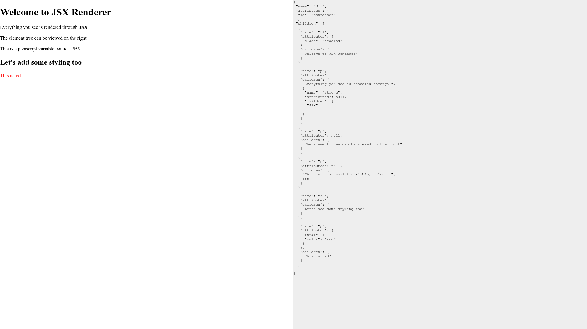

# JSX Renderer
A custom render implementation for the syntactic sugar that is JSX

## The Purpose 

The purpose of this project is to learn the inner workings of JSX and how it is processed by modern frontened frameworks. 
The projects uses [Webpack](https://webpack.js.org/) as the bundler of choice. Along with [Babel](https://babeljs.io/) 
for transpilation. The project is inspired by but goes beyond the following [article](https://jasonformat.com/wtf-is-jsx/) by [Jason Miller](https://github.com/developit). 

## How it works

The bulk of the application is contained within the `src/main.js` file. The code is well commented and explained. However,
to give a brief overview. The `main.js` file contains an annotation with a function name `hyper`, which is called by Babel for each JSX node. 
The output from this function is passed to the `render` function which then creates the appropriate HTML tag, sets the attributes and processes the chlidren for each node, finally returning it. At last, the output from the render function is appended to the parent `#root` container and hence shows up on the page. 

The left half of the page is the `#root`contianer where the output from the render function is appened. The right half is the `#tree`container, this container logs out the output from the `hyper` function as JSON to provide a clearer picture of what is happening behind the scenes. 

## Contribution

While this is just a project for eductional purposes, feel free to contribute to the project with changes that progress the project and aid in the understanding of JSX. 